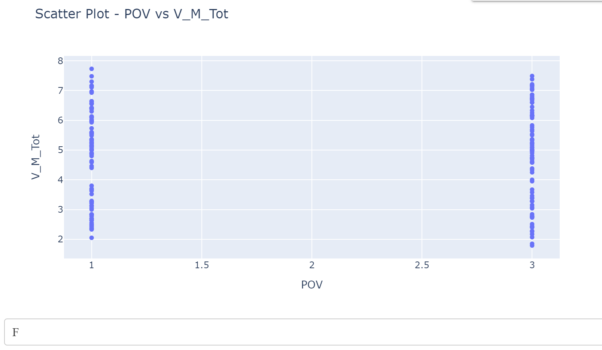
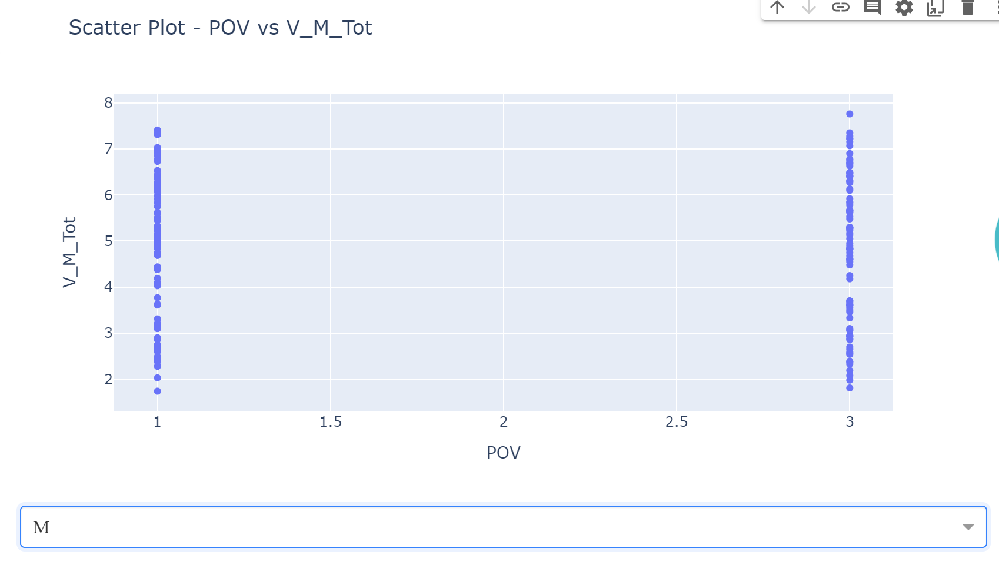

# Description 
This file is used to describe the data query procedure.

*Figure: flowchart created by [markmap.js](https://markmap.js.org/)*
## Data Query
The data was downloaded from the website [scientific Data](https://www.nature.com/sdata/).Below is the specific querying procedure.
### Step 1
 
-  Search Kaggle in Google and click *Dataset*

### Step 2

-  Click on the dataset which you are interested in

### Step 3

-  Open the page and click download

## Data Visualization
It is advised to visualize data by displaying the relationship between variables using the [Google Colab](https://colab.research.google.com/drive/1E-fTDAt_tkpsYSSr7L0pUIUXYDKfmqpi).
-  The following pictures are some data visualization examples. 

-  It shows the relationship between the mean of participants' emotion valence and the perspectives of the video which devided by the video actor's gender.

