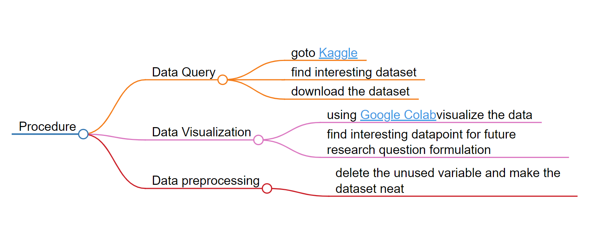
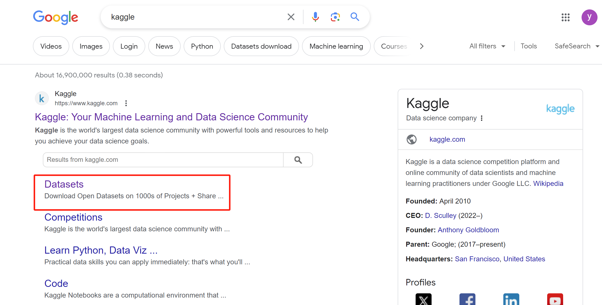
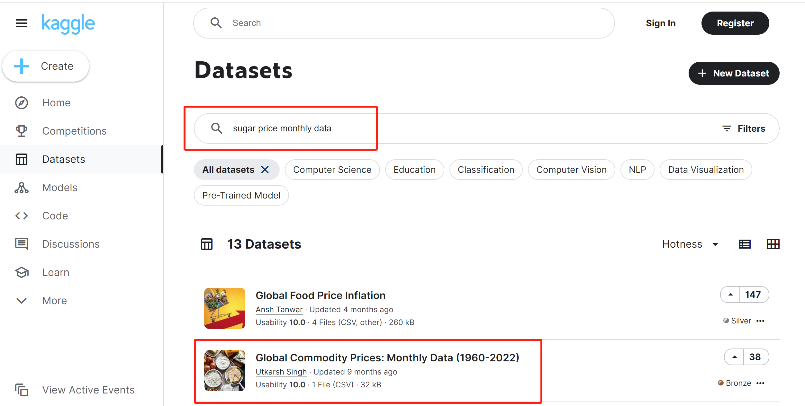
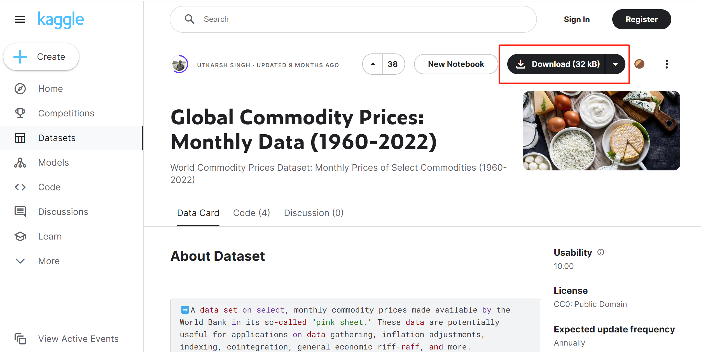
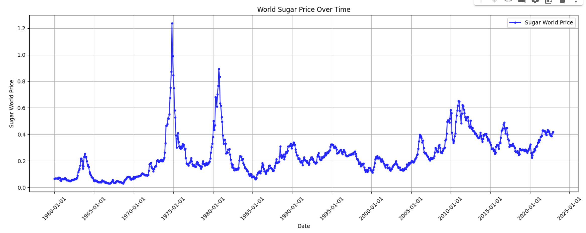
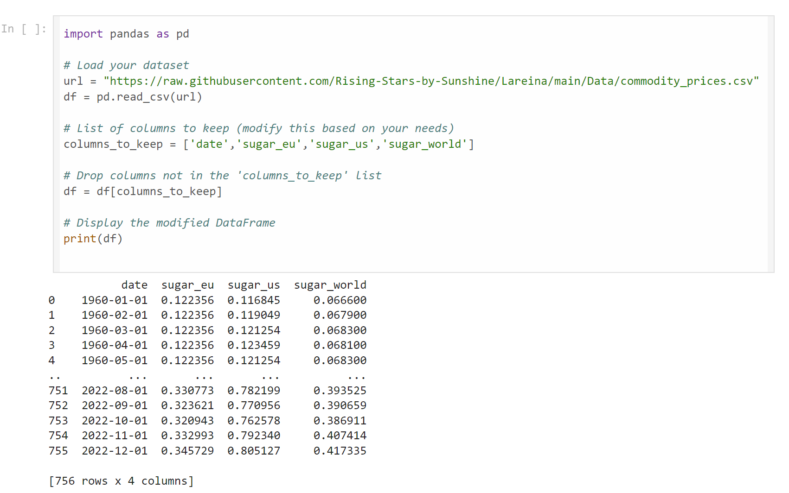

# Description 
This file is used to describe the data query procedure.

*Figure: flowchart created by [markmap.js](https://markmap.js.org/)*
## Data Query
The data was downloaded from the website [kaggle](https://www.kaggle.com/datasets).Below is the specific querying procedure.
### Step 1
 
-  Search Kaggle in Google and click *Dataset*

### Step 2

-  Click on the dataset which you are interested in

### Step 3

-  Open the page and click download

## Data Visualization
It is advised to visualize data by displaying the relationship between variables using the [Google Colab](https://colab.research.google.com/drive/1PRAbngey6B_vwdBE0yUL58sk4JAP3N71).
-  The following pictures are some data visualization examples. 

- It shows the world sugar price over time from 1960 to 2022. The unit is in USD.

## Data Precprocessing
[github](https://github.com/Rising-Stars-by-Sunshine/Lareina/blob/main/Code/data_preprocess.ipynb)

- Delete unused variables and ensure that the date representation is recognized by Python
