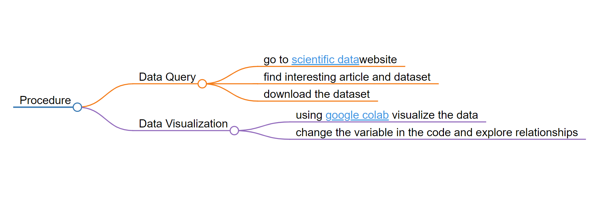
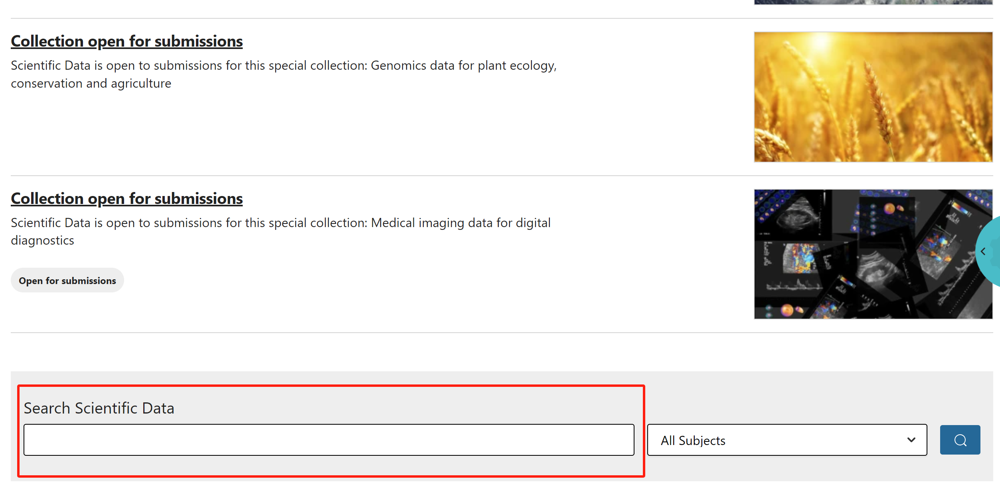
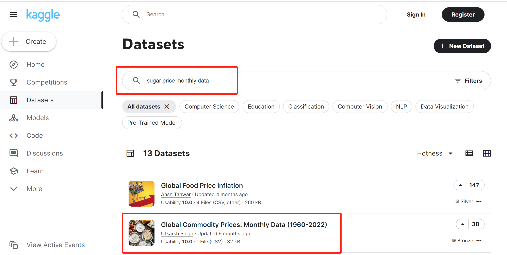
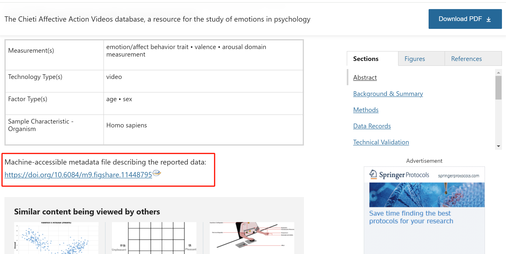
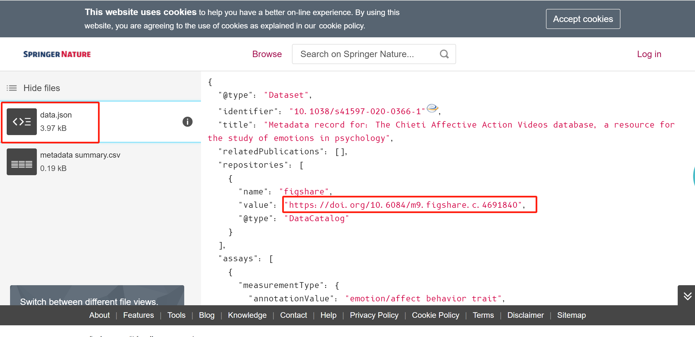
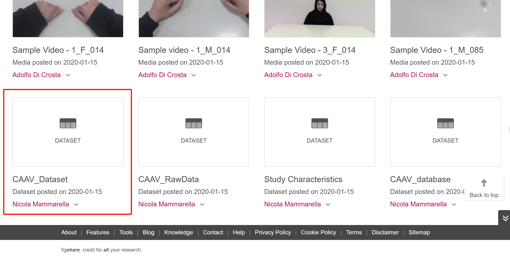

# Description 
This file is used to describe the data query procedure.

*Figure: flowchart created by [markmap.js](https://markmap.js.org/)*
# Data Query
The data was downloaded from the website [scientific Data](https://www.nature.com/sdata/).Below is the specific querying procedure.
## Step 1
 
### Swipe to the bottom of the page and enter the keyword for the data you are looking for

## Step 2

### Click on the article which you are interested in

## Step 3

### Scroll through the article and find links similar to those in the picture

## Step 4

### click *data.json* and find the link which direct to the respositories where the data located

## Step 5

### Copy and paste the link which show in the step 4 to a new tab. Scroll down to the bottom of the page, find the dataset that you are seeking for and then download it to your laptop.

## Data Visualization
[google colab](https://colab.research.google.com/drive/1E-fTDAt_tkpsYSSr7L0pUIUXYDKfmqpi)

## The pseudocode for the data query process

### Pseudocode

```plaintext
Algorithm DataQueryProcess
Input: # Project Title

## Data Query Process

This section outlines the pseudocode for the data query process in our project.

### Pseudocode

```plaintext
Algorithm DataQueryProcess
Input:emotion.csv

1. Read the CSV file into a dataframe

2. Initialize 

3. Execute the SQL query against the database

4. Process and format the query results

5. Return the formatted results to the user or application


