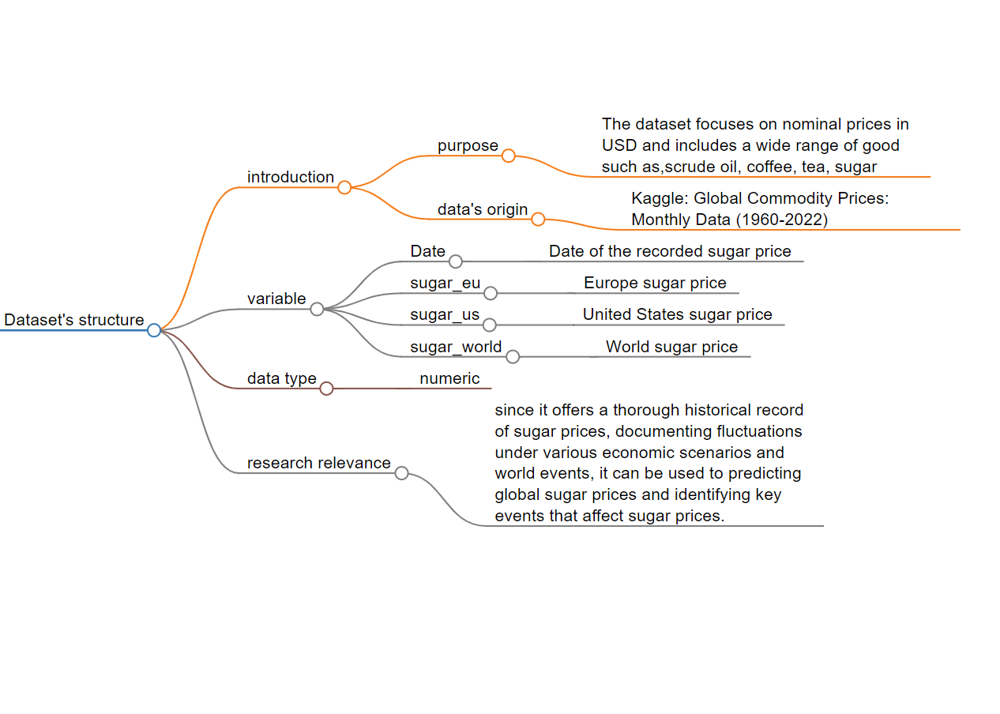

# Data

*Figure: Flowchart of the dataset’s structure from [markmap.js](https://markmap.js.org/)*
## Description and why related to research
-  This dataset is imported from The Chieti Affective Action Videos database (Di Crosta, et al., 2020). It captures participants'emotions stimulate by the video they watch through self-assessment.Two major dimension of the emotion, arousal and valence are evaluated. Arousal refers to the intensity of the emotion, whereas valence denotes the emotion's positivity or negativity. About ninety actions with either a male or female main actor and first- or third-person perspectives compose the video's content. The participants are divided evenly into two groups with 50% of the partcipants are male and two groups of participants evalute the video based on arousal and valence respectively. The following data dictionary record the description of the dataset in detailed.
-  There is sufficient high-quality data in this dataset for the machine learning algorithm to use. Along with the participant's emotional valence and arousal, the dataset also included specific information about the protagonist's gender and the video's filming perspective. This directly helps to answer the question I'm researching which is *When confronted with individuals of different genders from different perspectives, how may individual emotions respond differently?* 

## Data Source
[scientific data](https://www.nature.com/articles/s41597-020-0366-1)
## Data Dictionary
| Variable        | Meaning                        | Data Type | Unit | Range |
|-----------------|--------------------------------|-----------|------|-------|
| Date            | Date of the recorded sugar price| Date      | 1   | 1960-1-1 to 2022-12-1  |
| sugar_eu        | Europe sugar price              | Numeric   | 1    | 0.112215 to 0.783171    |
| sugar_us        | United States sugar price       | Numeric   | 1    | 0.116845 to 1.263247     |
| sugar_world     | World sugar price               | Categorical | 1  | 0.028700 to 1.237700    |

## Citation
-  Di Crosta, Adolfo; La Malva, Pasquale; Manna, Claudio; Marin, Anna; Palumbo, Rocco; Verrocchio, Maria Cristina; et al. (2020). Chieti Affective Action Video - CAAV: Technical Manual and Affective Rating. figshare. Collection. https://doi.org/10.6084/m9.figshare.c.4691840.v1
