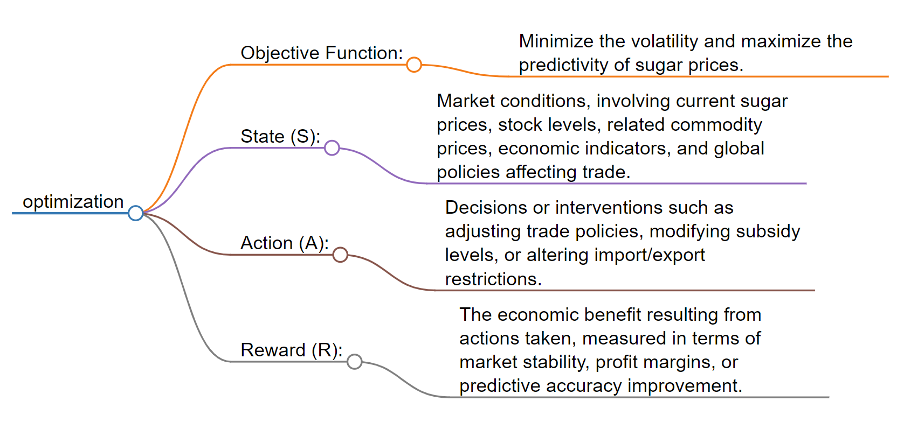

# Advancing Causal Inference in Sugar Price Analysis Using Machine Learning

*Figure: flowchart created by [markmap.js](https://markmap.js.org/)*
## Background and Motivation

The implications of price fluctuations in commodities like sugar are significant, impacting economies, industries, and farmers worldwide. Traditional economic modeling has often relied on linear regression techniques to predict future prices, but the ability to understand causal relationships within these market dynamics is crucial for sound decision-making. Our current research uses a linear regression machine learning algorithm to train part of the data with the aim of forecasting future sugar prices. Particularly, a regression discontinuity design has been employed to ascertain the causal impact of an exogenous shock—specifically, the Soviet Union's unexpected increase in sugar demand—on global sugar prices. This approach, however, offers a singular historical perspective on causality, raising the question of whether there are other influencing factors that sporadically affect sugar prices and if we can discern their causal effects.

## Research Questions

The main research questions we aim to address are:

1. Beyond historical shocks, what are the other potential factors affecting sugar prices?
2. Can we establish causal relationships between these factors and sugar prices?

## Methods

The current research can be extended by integrating causal inference methods beyond the previously used regression discontinuity design. We plan to utilize directed acyclic graphs (DAGs) to model the complex interplay between various economic, environmental, and political factors that could potentially impact sugar prices. We will apply methods such as Potential Outcomes Framework and Do-calculus for establishing causality. Instrumental variable analysis might also be implemented when facing variables that are endogenous.

## Potential Results

Incorporating these causal inference methods is expected to lead to a more robust understanding of what drives sugar prices. We anticipate finding novel insights into the causal relationships between various economic indicators, policy changes, climate factors, and sugar prices. These results could inform stakeholders in making more informed, proactive decisions.

## Contributions

The expected contributions of this research will have both intellectual and practical impacts. Intellectually, it will enrich the economic literature on commodity pricing and causal inference, highlighting new possibilities offered by machine learning techniques in the field of econometrics. Practically, it would help industry players and policy-makers in the agricultural sector to anticipate and mitigate the consequences of price volatility, leading to more stable and efficient markets.

# Optimization of Sugar Price Policy Using Reinforcement Learning

*Figure: flowchart created by [markmap.js](https://markmap.js.org/)*
## Background and Motivation

Global sugar markets exhibit complex dynamics influenced by a myriad of factors ranging from global economic trends to environmental conditions. Accurate prediction of sugar prices is vital for market stability and can have profound impacts on multiple stakeholders, including producers, consumers, and policymakers. Our current research employs a linear regression machine learning algorithm for predictive modeling. While this approach offers valuable forecasts, optimization of policy decisions that impact sugar prices remains a challenge. To address this, we are exploring reinforcement learning for policy optimization in the sugar trade, acting on an initial use case where we've demonstrated a causal relationship between the Soviet demand increase and the consequential surge in world sugar prices using a regression discontinuity design.

## Research Questions

Our exploration is driven by the following research questions:

1. How can we optimize decision-making policies to stabilize or benefit from sugar price fluctuations?
2. What reinforcement learning strategies can be applied to model and navigate the complexities of the sugar market?

## Methods

An advanced optimization method involving reinforcement learning will be promoted to evolve decision-making strategies concerning sugar prices. This method focuses on learning policy decisions that navigate the sugar price landscape effectively.

The core components of our RL approach include:

- **Objective Function:** Minimize the volatility and maximize the predictivity of sugar prices.
- **State (S):** Market conditions, involving current sugar prices, stock levels, related commodity prices, economic indicators, and global policies affecting trade.
- **Action (A):** Decisions or interventions such as adjusting trade policies, modifying subsidy levels, or altering import/export restrictions.
- **Reward (R):** The economic benefit resulting from actions taken, measured in terms of market stability, profit margins, or predictive accuracy improvement.

## Potential Results

The application of reinforcement learning in sugar price policy optimization is expected to yield strategies that can outperform conventional decision-making processes. By constantly learning from market responses and adjusting actions, the RL algorithm can discover innovative policies that promote stability and economic gain.

## Contributions

This research is positioned to make significant contributions to both theoretical and applied fields. Theoretically, it would enhance our understanding of reinforcement learning when applied to complex economic systems. Practically, it provides a tool for policymakers and market participants to improve their decision-making processes through data-driven, adaptive strategies.

