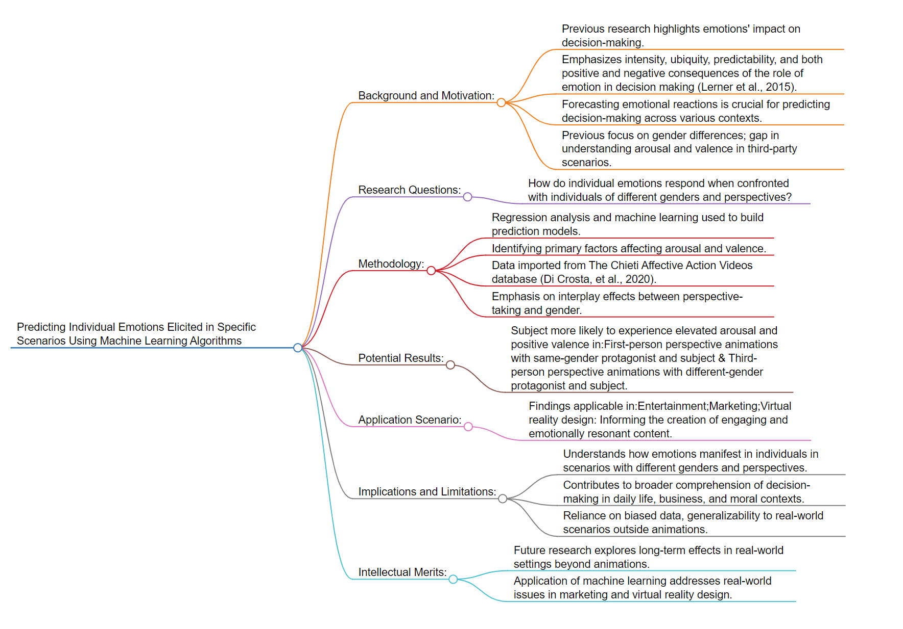

# Description
### This file include the *summary* of a paper which applies machine learning methodologies and *a research proposal*
# 1.1 Literature Review

*Figure: Flowchart of the paper’s structure from [markmap.js](https://markmap.js.org/)* 
## Background and Motivation:
-  This research delves into the globalization of the world economy, particularly focusing on the evolution of the sugar market, its susceptibility to speculation, and the impact of financialization (Maitah & Smutka, 2018). The historical roots trace back to the 1970s with the Bretton Woods and Smithsonian agreements, resulting in freely floating exchange rates and the deregulation of financial markets (Maitah & Smutka, 2018). The motivation lies in understanding how these factors, coupled with speculative activities, influence sugar prices, which have experienced unprecedented fluctuations.
-  The research holds significance in the context of global economic dynamics, especially in understanding how financialization and speculative activities impact agricultural commodity markets. The findings can contribute to discussions on market stability, policy implications, and the broader implications of global economic trends on specific sectors like sugar production.
**Unsolved Issues or Problems:**
-  The literature and real-world scenarios reveal a gap in understanding the intricate relationship between financialization, speculation, and the volatility of agricultural commodity prices, particularly in the sugar market. The rising interest of speculators and the unprecedented price fluctuations pose challenges that need exploration.
**Research Questions:**
1. How has the globalization and financialization of the world economy influenced the evolution of sugar prices?
2. What role do speculative activities, particularly by hedge funds, play in the fluctuations of sugar prices?
3. How has the sugar market responded to external factors such as the 2008/2009 financial crisis and the growing demand for biofuels?
**Methodology:**
-  This research utilizes data from World Bank Commodity Price Data, F. O. Licht, and TRADING ECONOMICS, focusing on the World Sugar Price (ISA contract No. 11) from 1960 to 2016. The study employs statistical indicators for analyzing price developments, including average value, median, variation coefficient, and deviation from the average. Custom analyses are conducted using pounds as the unit, and data is analyzed at current US dollar prices.
**Potential Results:**
1. Identification of changes in sugar price development over different decades.
2. Evaluation of the impact of speculative trades on the frequency and intensity of price fluctuations.
3. Examination of the correlation between financialization and the destabilization of sugar prices.
-  Potential findings may indicate a correlation between speculative activities and increased volatility in sugar prices.
-  Limitations include the reliance on historical data and potential challenges in isolating the impact of speculation from other market dynamics.
**Intellectual Merits and Impacts:**
-  The research advances existing literature by providing insights into the dynamics of the sugar market under the influence of financialization and speculation. Limitations include the need for ongoing research to address evolving market conditions. The findings may inspire future studies on market stability and policy recommendations.
-  The research contributes to discussions on the role of speculation in agricultural commodity markets, providing potential insights for policymakers, market participants, and researchers. Applications include informing decisions related to market regulations, risk management, and sustainable agricultural practices.
## Reference 
Maitah, M., & Smutka, L. (2018). The Development of World Sugar Prices. Sugar Tech, 21(1), 1–8. https://doi.org/10.1007/s12355-018-0618-y

# 1.2 Research Proposal

*Figure: Flowchart of the research proposal’s structure from [markmap.js](https://markmap.js.org/)* 
## Title: 
Using Machine Learning Algorithms to Predict Individual Emotions Elicitation Considering Gender and Storytelling Perspectives
## Background and Motivation: 
Prior research has demonstrated the impact of emotions on decision-making, emphasizing their intensity, ubiquity, predictability, and capacity for both positive and negative consequences (Lerner et al., 2015). Therefore, forecasting emotional reactions is an essential first step in predicting individual decision-making in a variety of contexts, from daily life to business settings and moral decisions. Although previous studies focused primarily on gender differences in the perception and expression of emotions, there is a dearth of research examining whether the arousal and valence of emotions differ between people acting as third parties in different scenarios with different genders and perspectives. In order to fill this gap, this research will use machine learning algorithms to forecast individual emotions toward people of different genders and perspectives. 
## Application scenario:
The findings could find application in diverse fields, including entertainment, marketing, and virtual reality design. Understanding how individuals react emotionally to specific scenarios can inform the creation of more engaging and emotionally resonant content.
## Research Questions:
When confronted with individuals of different genders from different perspectives, how may individual emotions respond differently? 
## Methodology:
Regression analysis and machine learning approach will be used to build prediction models in order to identify the primary factors affecting the arousal and valence of the individual's emotion. The data is imported from The Chieti Affective Action Videos database (Di Crosta, et al., 2020). The interplay effects between perspective-taking and gender will also be emphasized, since this could offer further insights into the systems predicting an individual's emotional state.
## Potential Results
Potential results indicate that the subject is more likely to feel elevated arousal and positive valence in first-person perspective animations where the protagonist and subject are of the same gender, and in third-person perspective animations where the protagonist and subject are of different genders.
## Implications: 
This research holds implications for understanding how emotions manifest in individuals when exposed to scenarios involving different genders and perspectives. By forecasting emotional reactions, it contributes to the broader comprehension of decision-making processes in various contexts, spanning daily life, business settings, and moral decision-making. One potential limitation is the reliance on data from The Chieti Affective Action Videos database, which may have inherent biases. Additionally, the generalizability of the findings to real-world scenarios outside of animated contexts needs careful consideration.
## Intellectual merits: 
Future research avenues may explore the long-term effects of emotional responses in decision-making, extending the study to real-world settings beyond animations. Additionally, investigating cultural influences on emotional reactions could provide a more nuanced understanding. The application of machine learning algorithms to predict emotional responses has the potential to address real-world issues. For instance, in marketing, understanding how individuals respond emotionally to advertisements with different gender dynamics could enhance advertising effectiveness. Similarly, in virtual reality design, tailoring experiences based on predicted emotional reactions can create more immersive and impactful simulations.
## References:
-  Di Crosta, A; La Malva, P; Manna, C; Marin, A; Palumbo, R; Verrocchio, M.C.; Cortini, M.; Mammarella, N.; Di Domenico, A. (2020). Chieti Affective Action Video - CAAV: Technical Manual and Affective Rating. figshare. Collection. https://doi.org/10.6084/m9.figshare.c.4691840.v1
-  Lerner, J. S., Li, Y., Valdesolo, P., & Kassam, K. S. (2015). Emotion and decision making. Annual review of psychology, 66, 799-823.
