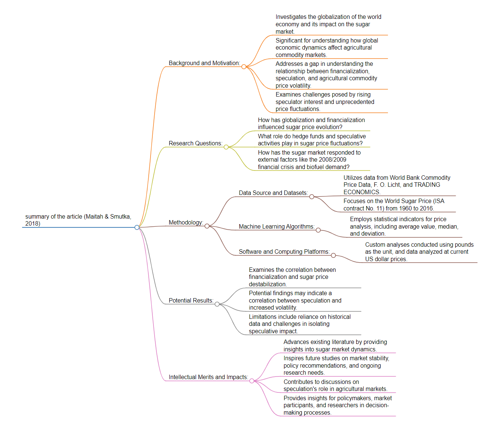
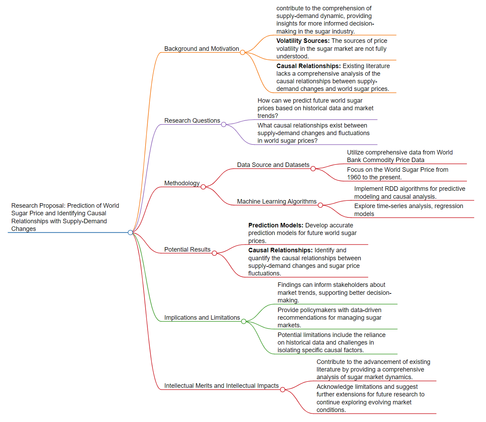

# Description
### This file include the *summary* of a paper which applies machine learning methodologies and *a research proposal*
# 1.1 Literature Review

*Figure: Flowchart of the paper’s structure from [markmap.js](https://markmap.js.org/)* 
## Background and Motivation:
-  This research delves into the globalization of the world economy, particularly focusing on the evolution of the sugar market, its susceptibility to speculation, and the impact of financialization (Maitah & Smutka, 2018). The historical roots trace back to the 1970s with the Bretton Woods and Smithsonian agreements, resulting in freely floating exchange rates and the deregulation of financial markets (Maitah & Smutka, 2018). The motivation lies in understanding how these factors, coupled with speculative activities, influence sugar prices, which have experienced unprecedented fluctuations.
-  The research holds significance in the context of global economic dynamics, especially in understanding how financialization and speculative activities impact agricultural commodity markets. The findings can contribute to discussions on market stability, policy implications, and the broader implications of global economic trends on specific sectors like sugar production.
-  The literature and real-world scenarios reveal a gap in understanding the intricate relationship between financialization, speculation, and the volatility of agricultural commodity prices, particularly in the sugar market. The rising interest of speculators and the unprecedented price fluctuations pose challenges that need exploration.
## Research Questions:
1. How has the globalization and financialization of the world economy influenced the evolution of sugar prices?
2. What role do speculative activities, particularly by hedge funds, play in the fluctuations of sugar prices?
3. How has the sugar market responded to external factors such as the 2008/2009 financial crisis and the growing demand for biofuels?
## Methodology:
-  This research utilizes data from World Bank Commodity Price Data, F. O. Licht, and TRADING ECONOMICS, focusing on the World Sugar Price (ISA contract No. 11) from 1960 to 2016. The study employs statistical indicators for analyzing price developments, including average value, median, variation coefficient, and deviation from the average. Custom analyses are conducted using pounds as the unit, and data is analyzed at current US dollar prices.
## Potential Results:
-  Identification of changes in sugar price development over different decades.
-  Evaluation of the impact of speculative trades on the frequency and intensity of price fluctuations.
-  Examination of the correlation between financialization and the destabilization of sugar prices.
-  Potential findings may indicate a correlation between speculative activities and increased volatility in sugar prices.
-  Limitations include the reliance on historical data and potential challenges in isolating the impact of speculation from other market dynamics.
## Intellectual Merits and Impacts:
-  The research advances existing literature by providing insights into the dynamics of the sugar market under the influence of financialization and speculation. Limitations include the need for ongoing research to address evolving market conditions. The findings may inspire future studies on market stability and policy recommendations.
-  The research contributes to discussions on the role of speculation in agricultural commodity markets, providing potential insights for policymakers, market participants, and researchers. Applications include informing decisions related to market regulations, risk management, and sustainable agricultural practices.
## Reference 
-  Maitah, M., & Smutka, L. (2018). The Development of World Sugar Prices. Sugar Tech, 21(1), 1–8. https://doi.org/10.1007/s12355-018-0618-y

# 1.2 Research Proposal

*Figure: Flowchart of the research proposal’s structure from [markmap.js](https://markmap.js.org/)* 
## Title: 
Prediction of World Sugar Price and Identifying Causal Relationships with Supply-Demand Changes

## Background and Motivation
The global sugar market has witnessed unprecedented volatility, influenced by factors such as financialization, speculation, and external economic events. Understanding the dynamics of world sugar prices is crucial for stakeholders ranging from producers to policymakers. This research aims to contribute to the comprehension of these dynamics, providing insights for more informed decision-making in the sugar industry.

### Application Scenarios or Broader Views
-  Market Stability:Enhance our understanding of the factors affecting sugar prices to contribute to overall market stability.
-  Policy Implications:Provide insights for policymakers to formulate effective strategies for managing sugar markets.
-  Sector-Specific Impacts:Identify how changes in sugar prices impact various stakeholders, from producers to consumers.

### Unsolved Issues or Problems
-  Volatility Sources:The sources of price volatility in the sugar market are not fully understood.
-  Causal Relationships:Existing literature lacks a comprehensive analysis of the causal relationships between supply-demand changes and world sugar prices.

## Research Questions
1. How can we predict future world sugar prices based on historical data and market trends?**
2. What causal relationships exist between supply-demand changes and fluctuations in world sugar prices?

## Methodology

### Data Source and Datasets
-  Utilize comprehensive data from World Bank Commodity Price Data.
-  Focus on the World Sugar Price from 1960 to 2022.

### Machine Learning Algorithms
- Implement RDD machine learning algorithms for predictive modeling and causal analysis.
- Explore time-series analysis and regression models.
  
## Potential Results
1. Prediction Models:Develop accurate prediction models for future world sugar prices.
2. Causal Relationships: Identify and quantify the causal relationships between supply-demand changes and sugar price fluctuations.

### Implications and Limitations
-  Market Insights:Findings can inform stakeholders about market trends, supporting better decision-making.
-  Policy Recommendations:Provide policymakers with data-driven recommendations for managing sugar markets.
-  Limitation: Potential limitations include the reliance on historical data and challenges in isolating specific causal factors.

## Intellectual Merits and Intellectual Impacts
-  Future Extensions:Acknowledge limitations and suggest further extensions for future research to continue exploring evolving market conditions.
-  Industry Solutions:Offer practical solutions for the sugar industry to manage risk and optimize decision-making.
-  Policy Implementation:Facilitate the implementation of effective policies to ensure market stability.
