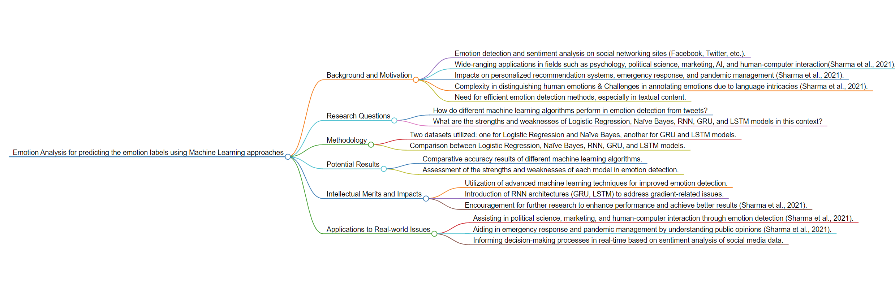

# Description
### This file include the *summary* of a paper which applies machine learning methodologies and *a research proposal*
# Literature Review

*Figure: Flowchart of the paper’s structure from markmap.js* 
## Background and Motivation:
What motivates this research is the importance of comprehending human emotions in the digital age, especially on social media sites like Facebook, Google, and Twitter since these platforms function as forums for people to express their thoughts and emotions (Sharma et al., 2021). Furthermore, numerous disciplines, such as psychology, political science, marketing, artificial intelligence, and human-computer interaction, have extensive uses for emotion analysis (Sharma et al., 2021). Finally, emotion detection plays an important role in improving several applications, including pandemic management, emergency response, and personalized recommendation systems which have significant practical meaning (Sharma et al., 2021). However, the complexities of human emotions, coupled with language intricacies, pose challenges in accurately annotating and distinguishing emotions (Sharma et al., 2021. Existing literature lacks comprehensive solutions for efficient emotion detection, especially in textual content (Sharma et al., 2021). Thus this research tends to compare different Machine learning algorithms in emotion detection and sentiment analysis (Sharma et al., 2021). 
## Research Questions:
Just as the questions listed in the flowchart. The research tries to answer “How do different machine learning algorithms, including Logistic Regression, Naïve Bayes, RNN, GRU, and LSTM, perform in emotion detection from tweets?” and “What are the strengths and weaknesses of these models in the context of emotion detection?”
## Methodology:
The study employs a comparative approach, evaluating the performance of various machine learning algorithms—Logistic Regression, Naïve Bayes, RNN, GRU, and LSTM—on emotion detection (Sharma et al., 2021). Two datasets are utilized, one for Logistic Regression and Naïve Bayes and another for GRU and LSTM models. The analysis involves assessing accuracy results for each algorithm (Sharma et al., 2021).
## Potential Results:
Potential findings include comparing the accuracy of various machine learning algorithms and analyzing each model's advantages and disadvantages in terms of emotion recognition, which is also indicated in the flowchart (Sharma et al., 2021). More specifically, LSTM outperforms GRU and Logistic Regression outperforms Naïve Bayes in terms of accuracy for emotion classification (Sharma et al., 2021). 
## Intellectual Merits and Impacts:
The research holds implications for improving emotion detection across various applications. It also advances existing literature by incorporating advanced machine learning techniques and introducing RNN architectures (GRU, LSTM) to address gradient-related issues (Sharma et al., 2021). Acknowledging the limitations, the study encourages future research to enhance performance and achieve better results.
## Applications to Real-world Issues:
The study's applications extend to real-world scenarios, including assisting in political science, marketing, and human-computer interaction through emotion detection (Sharma et al., 2021). Additionally, the research can aid in emergency response and pandemic management by understanding public opinions (Sharma et al., 2021). Finally, the findings have the potential to inform decision-making processes in real-time based on sentiment analysis of social media data.
## Reference：
Sharma, T., Diwakar, M., Singh, P., Lamba, S., Kumar, P., & Joshi, K. (2021). Emotion Analysis for predicting the emotion labels using Machine Learning approaches. 2021 IEEE 8th Uttar Pradesh Section International Conference on Electrical, Electronics and Computer Engineering (UPCON). https://doi.org/10.1109/upcon52273.2021.9667562

# Research Proposal

*Figure: Flowchart of the paper’s structure from markmap.js* 
## Title: 
Using Machine Learning Algorithms to Predict Individual Emotions Elicitation Considering Gender and Storytelling Perspectives
## Background and Motivation: 
Prior research has demonstrated the impact of emotions on decision-making, emphasizing their intensity, ubiquity, predictability, and capacity for both positive and negative consequences (Lerner et al., 2015). Therefore, forecasting emotional reactions is an essential first step in predicting individual decision-making in a variety of contexts, from daily life to business settings and moral decisions. Although previous studies focused primarily on gender differences in the perception and expression of emotions, there is a dearth of research examining whether the arousal and valence of emotions differ between people acting as third parties in different scenarios with different genders and perspectives. In order to fill this gap, this research will use machine learning algorithms to forecast individual emotions toward people of different genders and perspectives. 
## Application scenario:
The findings could find application in diverse fields, including entertainment, marketing, and virtual reality design. Understanding how individuals react emotionally to specific scenarios can inform the creation of more engaging and emotionally resonant content.
## Research Questions:
When confronted with individuals of different genders from different perspectives, how may individual emotions respond differently? 
## Methodology:
Regression analysis and machine learning approach will be used to build prediction models in order to identify the primary factors affecting the arousal and valence of the individual's emotion. The data is imported from The Chieti Affective Action Videos database (Di Crosta, et al., 2020). The interplay effects between perspective-taking and gender will also be emphasized, since this could offer further insights into the systems predicting an individual's emotional state.
## Potential Results
Potential results indicate that the subject is more likely to feel elevated arousal and positive valence in first-person perspective animations where the protagonist and subject are of the same gender, and in third-person perspective animations where the protagonist and subject are of different genders.
## Implication: 
This research holds implications for understanding how emotions manifest in individuals when exposed to scenarios involving different genders and perspectives. By forecasting emotional reactions, it contributes to the broader comprehension of decision-making processes in various contexts, spanning daily life, business settings, and moral decision-making. One potential limitation is the reliance on data from The Chieti Affective Action Videos database, which may have inherent biases. Additionally, the generalizability of the findings to real-world scenarios outside of animated contexts needs careful consideration.
## Intellectual merits: 
Future research avenues may explore the long-term effects of emotional responses in decision-making, extending the study to real-world settings beyond animations. Additionally, investigating cultural influences on emotional reactions could provide a more nuanced understanding. The application of machine learning algorithms to predict emotional responses has the potential to address real-world issues. For instance, in marketing, understanding how individuals respond emotionally to advertisements with different gender dynamics could enhance advertising effectiveness. Similarly, in virtual reality design, tailoring experiences based on predicted emotional reactions can create more immersive and impactful simulations.
## References:
-  Di Crosta, A; La Malva, P; Manna, C; Marin, A; Palumbo, R; Verrocchio, M.C.; Cortini, M.; Mammarella, N.; Di Domenico, A. (2020). Chieti Affective Action Video - CAAV: Technical Manual and Affective Rating. figshare. Collection. https://doi.org/10.6084/m9.figshare.c.4691840.v1
-  Lerner, J. S., Li, Y., Valdesolo, P., & Kassam, K. S. (2015). Emotion and decision making. Annual review of psychology, 66, 799-823.
