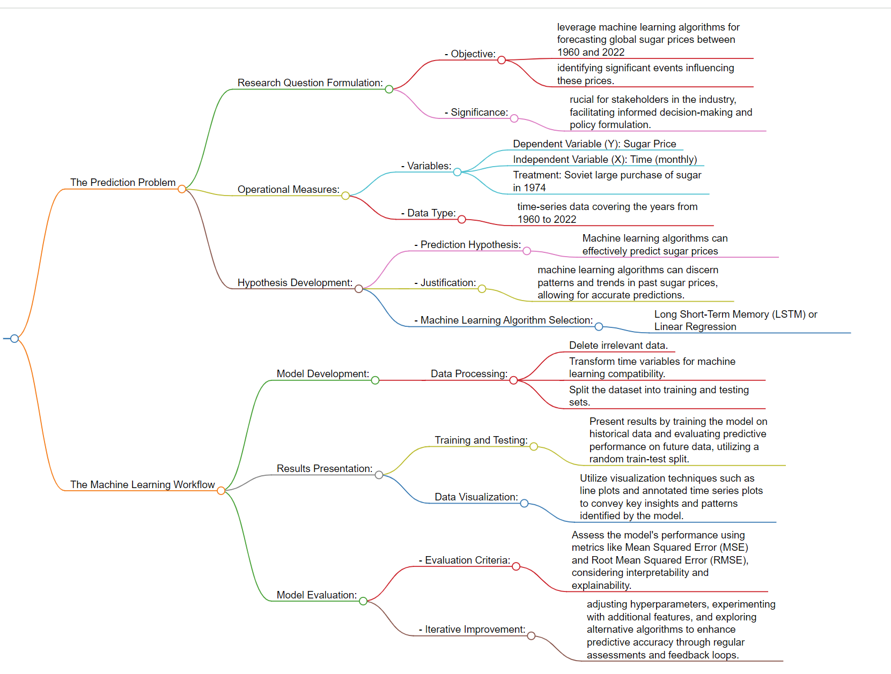
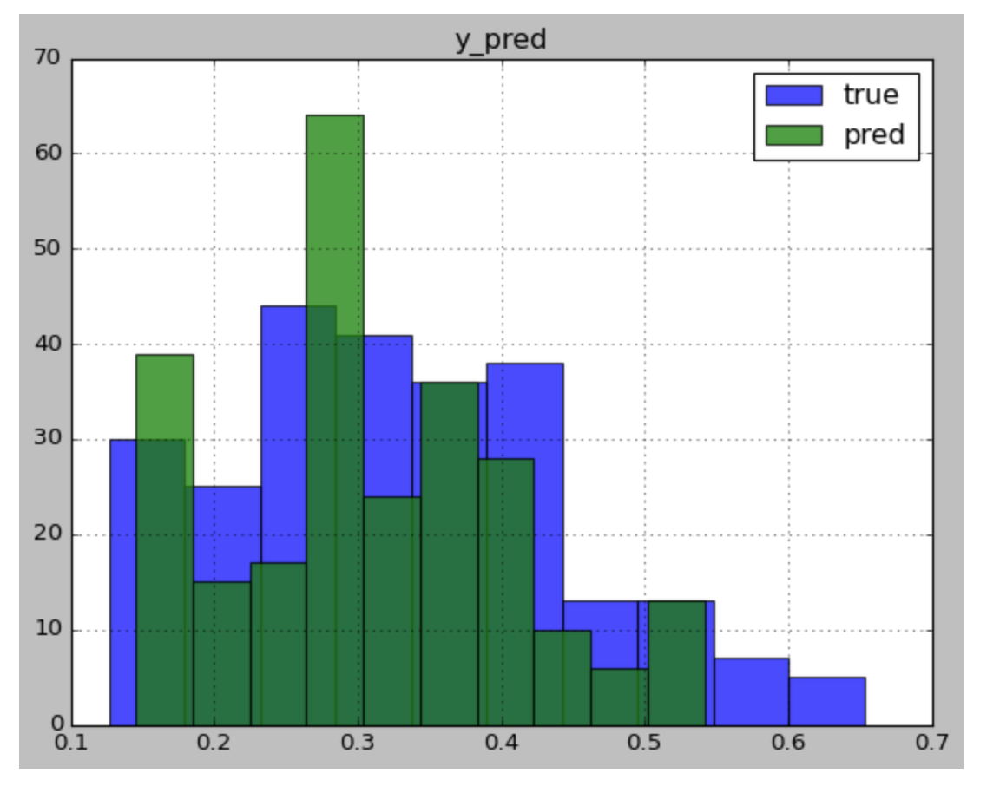
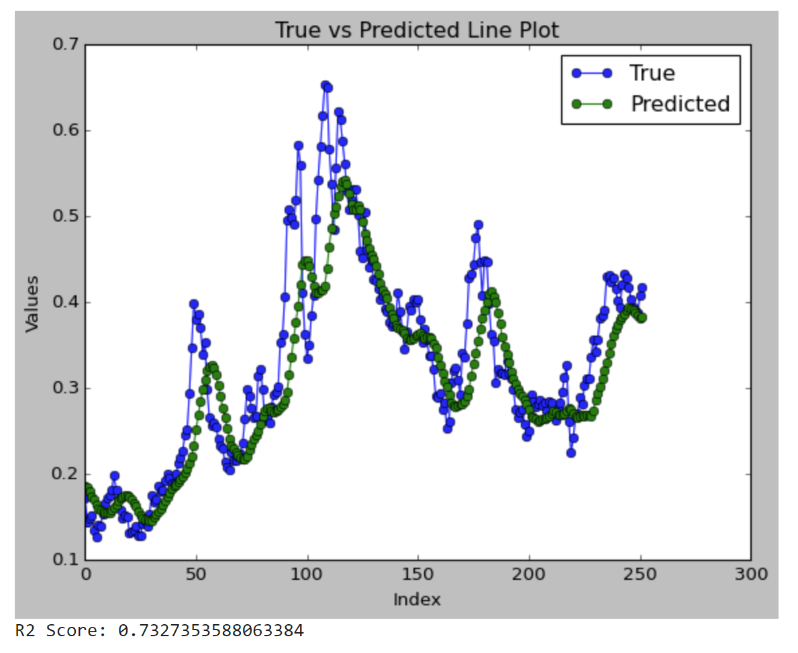

# Description 
This file is used to describe the research method.

*Figure: flowchart created by [markmap.js](https://markmap.js.org/)*

# The Prediction Problem

## Research Question Formulation:

### - Objective: 
The primary aim of this study is to leverage machine learning algorithms for forecasting global sugar prices between 1960 and 2022, with a secondary goal of identifying significant events influencing these prices.

### - Significance: 
Understanding the predictive capabilities of machine learning models for sugar prices is crucial for stakeholders in the industry, facilitating informed decision-making and policy formulation.

## Operational Measures:

### - Variables: 
- Dependent Variable (Y): Sugar Price
- Independent Variable (X): Time (monthly)
- Treatment: Soviet large purchase of sugar in 1974

### - Data Type: 
The dataset is time-series data covering the years from 1960 to 2022, capturing the temporal dynamics of world sugar prices.

## Hypothesis Development:

### - Prediction Hypothesis: 
- Machine learning algorithms can effectively predict sugar prices based on historical time-series data
- The substantial sugar purchase made by the Soviet Union in 1974 had a causal relationship with a significant increase in world sugar prices during the same period

### - Justification: 
- The hypothesis is grounded in the idea that machine learning algorithms can discern patterns and trends in past sugar prices, allowing for accurate predictions. 
- The sudden increase in demand from the Soviet Union might have outpaced the capacity of other sugar-producing nations to meet the additional requirements promptly, causing a surge in prices.
### - Machine Learning Algorithm Selection: 
- For time-series prediction, the research will explore the use of algorithms such as Long Short-Term Memory (LSTM) or Linear Regression. These algorithms are well-suited for capturing temporal dependencies in data, which is essential for predicting future time-series values.
- RDD can be used to examine the causal relationship between certain circumstances or occurrences and variations in the price of sugar around the world. When there is a distinct cutoff point or threshold that establishes whether an event or condition occurs, RDD is especially helpful.By taking temporal thresholds into account, RDD can be modified to handle time-series data. 

# The Machine Learning Workflow

## Model Development:

### - Data Processing:
- Delete irrelevant data.
- Transform time variables for machine learning compatibility.
- Split the dataset into training and testing sets.

## Results Presentation:

### - Training and Testing: 
Present results by training the model on historical data and evaluating predictive performance on future data, utilizing a random train-test split.

### - Data Visualization: 
Utilize visualization techniques such as line plots and annotated time series plots to convey key insights and patterns identified by the model.

## Model Evaluation:

### - Evaluation Criteria: 
Assess the model's performance using metrics like Mean Squared Error (MSE) and Root Mean Squared Error (RMSE), considering interpretability and explainability.

### - Iterative Improvement: 
Implement continuous model refinement by adjusting hyperparameters, experimenting with additional features, and exploring alternative algorithms to enhance predictive accuracy through regular assessments and feedback loops.

### Potential outcome

