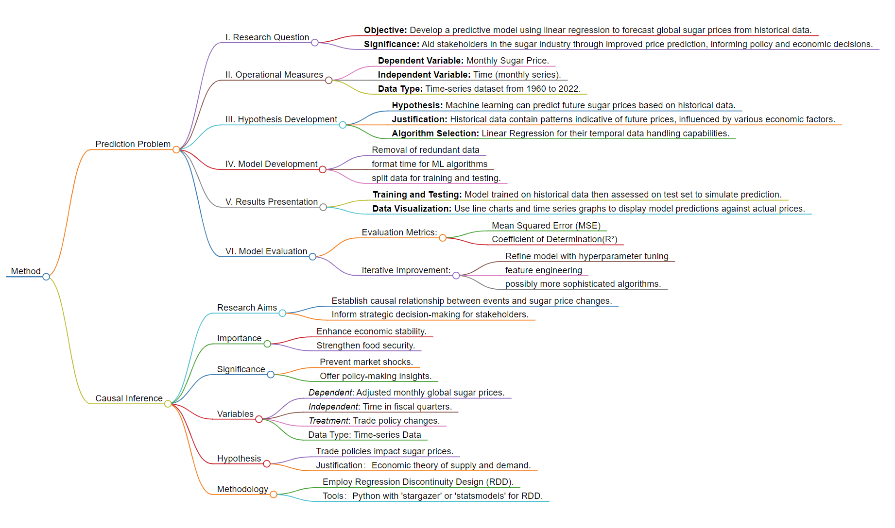

# Description 
This file is used to describe the research method.

*Figure: flowchart created by [markmap.js](https://markmap.js.org/)*

# The Prediction Problem
## Research Question
### Objective
The primary objective of this investigation is to develop and validate a predictive model using linear regression machine learning algorithms to forecast global sugar prices. The model will be grounded in rigorous quantitative analysis, leveraging historical time-series data to generate precise future price predictions.
### Significance
Understanding and forecasting global sugar prices hold considerable significance for various stakeholders in the sugar market, from farmers and refiners to traders and policymakers. The rationale behind developing a predictive model using linear regression machine learning algorithms to forecast global sugar prices is anchored on several key reasons supported by existing research and data:
Firstly, economic research highlights the sugar industry's substantial role in global trade and employment. According to the International Sugar Organization (ISO), the sugar sector is a major economic driver in many countries and companies, contributing to both GDP and international trade dynamics (Narayan & Prasad, 2005). Predictive modeling can provide actionable insights for market participants to make informed decisions regarding production, investment, and trade.
Additionally, from an environmental perspective, research underscores the need for sustainability in the sugar industry. Advances in predictive analytics can aid in managing the environmental footprint of sugar production by optimizing supply chain logistics, reducing waste, and encouraging responsible resource use (García et al., 2016).
Lastly, the intersection of the sugar market with biofuel production has gained traction, as shown by energy sector analyses (Martin, 2007). A predictive model can guide biofuel producers in their planning and contribute to broader energy security strategies.
In essence, developing and validating a machine learning model to forecast global sugar prices is not only a technologically innovative endeavor but one that holds profound implications across economic, environmental, and energy domains. This approach leverages existing data and statistical tools to provide foresight in a market that is integral to human society and has far-reaching global influence.
## Operational Measures
### Variables
- **Dependent Variable (Y):** The dependent variable in this study is the Sugar Price, measured on a monthly basis.
- **Independent Variable (X):** Time (monthly) represents the independent variable. Each data point corresponds to a specific month, providing a temporal sequence for analysis.
### Data Type
This research harnesses a time-series dataset ranging from the year 1960 to 2022. This longitudinal span captures the intricacies and temporal fluctuations of the global sugar price to facilitate a robust time-series analytical approach.
## Hypothesis Development
### Hypothesis
We hypothesize that through the application of machine learning algorithms, it is possible to construct a model that will deliver effective predictions for future sugar prices based on historical time-series data.
### Justification
This hypothesis is premised on the assumption that historical sugar price data contain inherent temporal patterns and trends which, when modeled through machine learning algorithms, allow for reliable future projections. The historical fluctuation in sugar prices is influenced by a confluence of factors including transaction policies, economic upheavals, and consumer demand patterns, thus offering a wealth of structured information for the predictive model to learn from.
### Machine Learning Algorithm Selection
For the purposes of this investigation, the deployment of algorithms such as Long Short-Term Memory (LSTM) networks and Linear Regression will be examined. These methods are chosen for their aptitude in model temporal dependencies and sequences, which are indispensable in forecasting future time-series values.

## Model Development
### Data Processing
- Superfluous data shall be meticulously expunged from the dataset.
- The time variable will be converted into a machine learning-compatible format, either as a numerical sequence or encoded as cyclical features to preserve its temporal nature.
- The dataset will undergo division into training and testing partitions to facilitate model learning and subsequent evaluation.

## Results
### Training and Testing
The machine learning model's ability to generalize will be ascertained by training it on the historical data and subsequently gauging its performative capacity on the testing set, which mimics unseen future data. The training-testing split will be performed in a randomized fashion while ensuring temporal congruity is maintained in the dataset.
### Data Visualization
Employ a suite of visualization tools such as line charts, density plots, and annotated time series graphs to articulate the model's predictive proficiency. These visualizations will draw attention to the temporal alignment and deviations between the forecasted and actual sugar prices, presenting a clear visual narrative of the model’s performance.

## Model Evaluation
### Evaluation Criteria
The evaluation of the model will utilize quantitative measures such as Mean Squared Error (MSE) and Coefficient of Determination(R²) to ascertain the predictive discrepancies. Additionally, the model’s interpretability and the explicability will be considered as critical factors in the evaluation process to ensure the model's utility to stakeholders.

### Iterative Improvement
The research will be characterized by a continuous cycle of model refinement, involving hyperparameter tuning and possibly the consideration of alternative, more sophisticated algorithms such as ensemble methods or advanced neural networks to surpass the predictive power of the baseline models. This iterative process will integrate ongoing assessments and constructive feedback to steadily enhance predictive accuracy and ensure the model's applicability to real-world scenarios.

## References
-    García, C. A., García-Treviño, E. S., Aguilar-Rivera, N., & Armendáriz, C. (2016). Carbon footprint of sugar production in Mexico. Journal of Cleaner Production, 112, 2632–2641. https://doi.org/10.1016/j.jclepro.2015.09.113
-    Martin, V. L. (2007). Economics and agricultural market impacts of growing biofuel production. German Journal of Agricultural Economics, 56(05-06). https://doi.org/10.22004/ag.econ.96747
-    Narayan, P. K., & Prasad, B. C. (2005). ECONOMIC IMPORTANCE OF THE SUGAR INDUSTRY FOR FIJI. Review of Urban and Regional Development Studies, 17(2), 104–114. https://doi.org/10.1111/j.1467-940x.2005.00097.x
  
# Causal Inference
## Research Question
### Aim and Importance
The primary intention of this research is to detect, analyze, and establish a scientifically substantiated causal relationship between the influential event and the consequent changes in sugar prices. A comprehensive understanding of the sugar price changes is not merely academically interesting; it holds significant practical value. It equips consumers, businesses, and governmental bodies to enhance their strategic initiatives, thereby attenuating economic vulnerabilities, fortifying food security, and endorsing sustainable agricultural practices globally.

### Research Significance
The anticipation of sugar price trends is vital for preventing market shocks and ensuring the economic viability of the sugar industry. By identifying and understanding the underlying factors, this study will offer insights into defensive and proactive policy-making that can lead to more resilient supply chains and equitable international trade environments. 

## Operational Measures
### Variables
1. **Dependent Variable:** 
    - The dependent variable will be the monthly global sugar prices from 1960 to 2022, adjusted for inflation and expressed in constant currency terms.
2. **Independent Variables:**
    - Time as a quantitative sequence, categorically partitioned into relevant fiscal quarters to investigate any seasonality effects.
3. **Treatment Variables:**
    - Changes in global trade policies impacting sugar exports and imports, characterized as intervention points that potentially perturb the sugar price equilibrium.

### Data Type
A comprehensive time-series data composition will be employed, consisting of the global sugar prices.

## Hypothesis Development
### Causal Hypothesis
We postulate that there exists a quantifiable and causative nexus between fluctuations in global sugar prices and policy alterations on trade.

### Justification
The premise of this hypothesis is rooted in the economic theory of supply and demand, where sugar prices are subject to the idiosyncrasies of global trade dynamics. Notably, policy changes manifest as pivotal inflection points that can either constrict or liberate market forces, reflected by alterations in commodity prices. For example, the institution of stringent trade barriers or sanctions can precipitate a supply-side crunch, escalating sugar prices, while liberalization efforts and the abatement of trade embargoes are likely to engender a competitive market scenario, potentially driving down prices.

## Machine Learning Algorithm and Package Selection

### Proposed Methodological Approach
The study will employ Regression Discontinuity Design (RDD) to scrupulously dissect the causal relationships underlying the distinct events or policy shifts with the variegations in global sugar prices. The RDD methodology is particularly efficacious when a crisp cutoff or threshold demarcates the occurrence of an intervention, allowing us to analyze its immediate and long-term impacts on sugar prices.

### Technological Implementation
For the implementation of the RDD, an advanced statistical computing environment like Python will be employed, utilizing comprehensive libraries such as'stargazer' or 'statsmodels' in Python, permitting a nuanced elucidation of temporal thresholds and their effects on the dependent variable. This methodology, encapsulating temporal cutoffs coupled with sophisticated algorithmic constructs, is envisioned to yield a dual benefit—an enhancement in predictive analytics paired with the attunement to causal inference rigor, essential for disentangling the complexities of commodity markets like that of global sugar.
