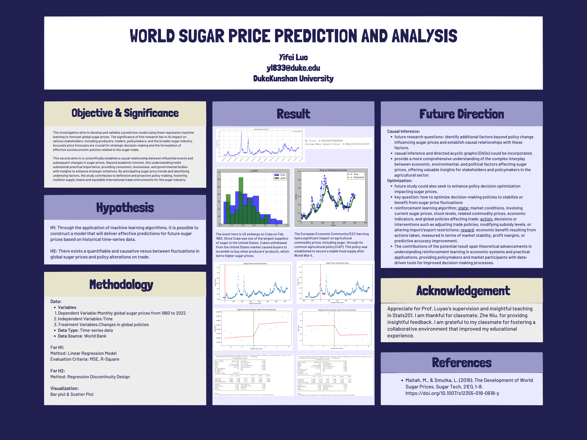

# World Sugar Price Prediction and Analysis Research Project
## Description
This resource is devoted to studies and research on global sugar price prediction. It functions as a complete resource, containing the datasets required to do studies and forecasts regarding the price of sugar. The repository offers comprehensive details on the datasets used, providing an understanding of their architecture and the steps taken to query the data. Additionally, the repository also contains a thorough coding process that provides a step-by-step manual for putting machine learning models into practice for precise and successful prediction. Furthermore, the repository contains a detailed description of the machine learning workflow, which includes the methods, algorithms, and assessment measures used throughout the predictive modeling phase. The augmented content guarantees that users obtain not only the requisite datasets and research materials but also gain a comprehensive comprehension of the technical facets associated with the creation and implementation of machine learning models customized for global sugar price forecasting.
 
## Table of content
-  [Readme.md](https://github.com/Rising-Stars-by-Sunshine/Lareina/blob/main/README.md)
-  [Literature](https://github.com/Rising-Stars-by-Sunshine/Lareina/tree/main/Literature)
-  [Data](https://github.com/Rising-Stars-by-Sunshine/Lareina/tree/main/Data)
-  [Code](https://github.com/Rising-Stars-by-Sunshine/Lareina/tree/main/Code)
-  [Method](https://github.com/Rising-Stars-by-Sunshine/Lareina/tree/main/Method)
-  [Result](https://github.com/Rising-Stars-by-Sunshine/Lareina/tree/main/Result)
-  [Future direction](https://github.com/Rising-Stars-by-Sunshine/Lareina/tree/main/Future%20Research%20Direction)
## About the author

### Education:
-  Institution: *Duke Kunshan University*
-  Degree: Pursuing Dual degree of B.S.
-  Graduation year: 2025
-  Major: Behavioral Science—Psychology
### Professional Summary:
-  Serving for nine months as a research assistant in a program pertaining to public mental health.
-  Working as a researcher in a desk research, examining the family education strategy and self-esteem of middle school pupils, and producing a paper that is indexed in CNKI and CPCI.
-  Serving as a research assistant for a program that analyzes the consumption patterns of migrant populations in order to help the company better enhance the quality of life for its blue-collar workers.
-  Serving as a Research Assistant in the project of Mental Health and Elder Care in Urban Transition. 
### Work Experience:
-  Working in the College International Social Media Team 
-  Once worked as an intern in the Greater China Youth Exchange Center Co, LTD as project operation manager
### Skills and Expertise:
-  Fluent in both English and mandarin 
-  Expertise in Photoshop, Premiere and other office softwareS
### Interests:
-  Photography/Pickleball/Pilates
### Contact Info:
-  Email: yl833@duke.edu

## Project Summary

### Background/Motivation
The primary objective of this investigation is to develop and validate a predictive model using linear regression machine learning algorithms to forecast global sugar prices. The second aim is to detect, analyze, and establish a scientifically substantiated causal relationship between the influential event and the consequent changes in sugar prices. Becasue understanding global sugar prices is crucial due to the pivotal role they play in the economies of many countries and their impact on health and environmental sustainability.Studying it also helps in attenuating economic vulnerabilities, fortifying food security, and endorsing sustainable agricultural practices globally.

### Hypothesis
1. How can linear regression machine learning algorithms be optimized to forecast global sugar prices?
2. There exists a quantifiable and causative nexus between fluctuations in global sugar prices and policy alterations on trade. In this case, the policy include US embargo on Cuba and common agricultural policy (CAP) implemented by European Union (EU).

### Data Source
The research utilizes monthly historical data sets on sugar prices from 1960 to 2022 collected by world bank.

### Methodology
Linear regression machine learning algorithms, which were trained using robust historical pricing data will be used. Regression Discontinuity Design (RDD) will also be used to dissect the causal relationships underlying the distinct events or policy shifts with the variegations in global sugar prices.

### Results
The model reasonably predicts sugar prices with an R² of 0.695, suggesting that roughly 69.5% of the variance in sugar prices is predictable by the model. The low MSE indicates that the model has a small error magnitude in the context of sugar price predictions.Thus, predictive model confirms that historical sugar prices can be used to forecast future prices with reasonable accuracy and low prediction error. Also, the occurrence of the EC Sugar Regime and the US Embargo on Cuba is associated with significant fluctuations in global sugar prices, validating the suspected causal relationship.

### Intellectual Merits and Practical Impacts of Your Project
Intellectually, the project contributes to the field of econometrics by enhancing the understanding of how machine learning can be applied to economic forecasting. Practically, it offers tools for stakeholders in the sugar market to make more informed decisions, thereby potentially stabilizing market fluctuations and contributing to more sustainable economic planning.

### Poster Picture

## Final Refelction
I believe that using machine learning to address problems offers me a fresh or more reliable viewpoint. A lot of social science research limits itself to surveys or experiments, which can only produce correlation data at most. Nevertheless, if a machine learning algorithm applies, it may produce a more accurate outcome in terms of the degree of causal relationship. Thus, the magic of interdisciplinary research lies in its ability to break down myopic views that often limit problem-solving within one field. It's about combining the quantitative, computational precision of machine learning with the qualitative, nuanced understanding of socioeconomic landscapes. The result is an enriched perspective that fosters comprehensive solutions to challenges such as inequality, environmental sustainability, and economic stability.
Professionally, this course catalyzes growth by necessitating the mastery of a diverse skill set. It's not merely about understanding algorithms and data structures; it's also about cultivating an analytical mindset and developing the ability to communicate complex concepts. 
I don't have a clear idea about what I will become the mother and founding father of currently. However, after taking this course, I feel more competent and eager to use cutting-edge technology to solve issues that support the advancement of human society. Having studied psychology, I am also increasingly convinced that developing advanced algorithms can benefit mental health in people and the prevention and treatment of mental illness which is the field I want to dedicate myself to. 
