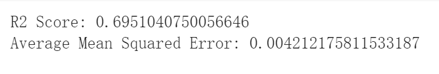
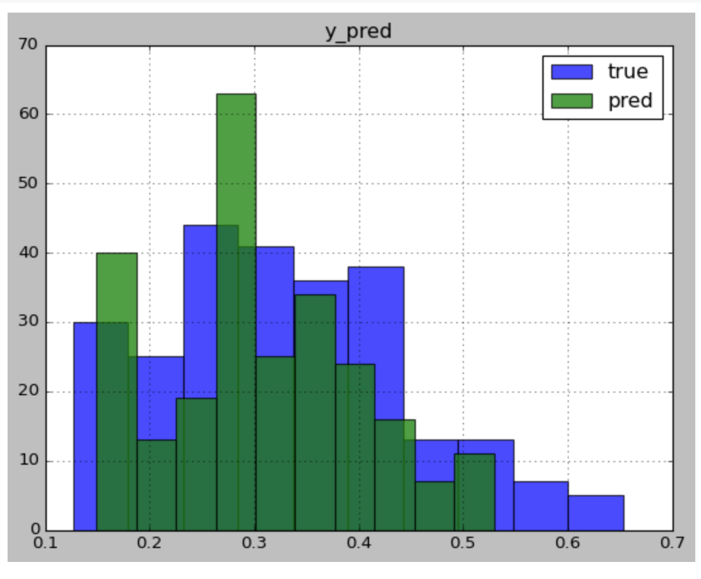
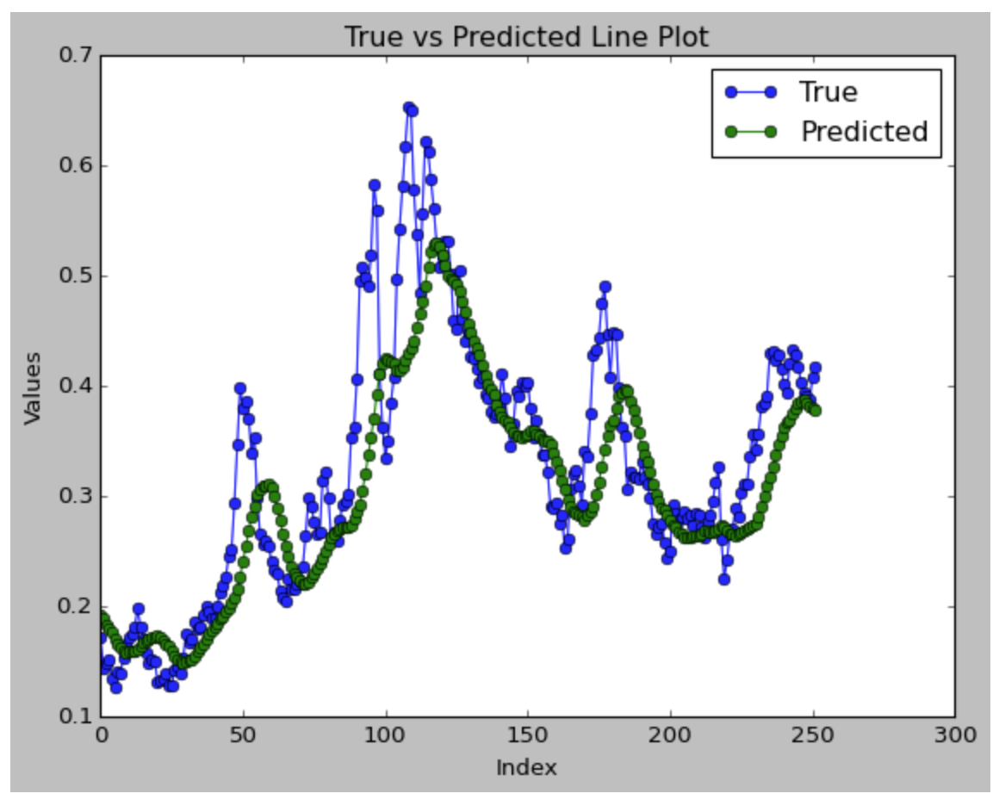
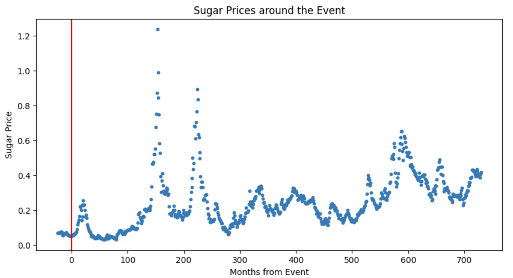
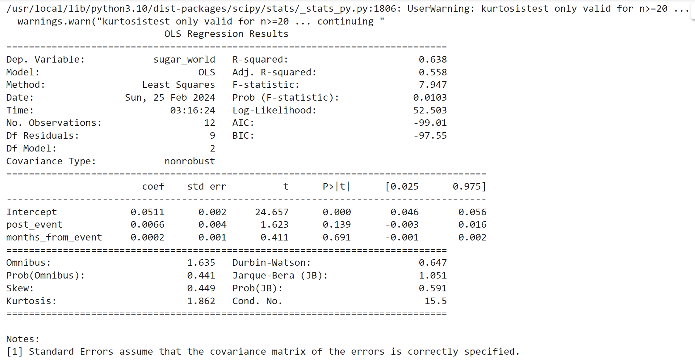
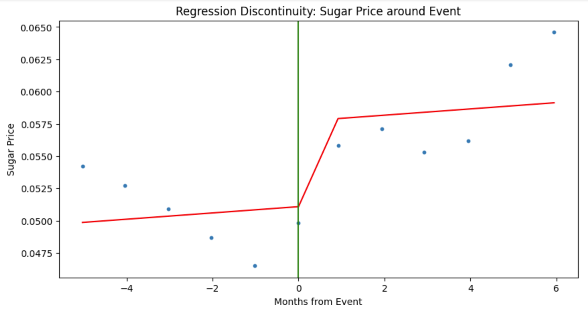
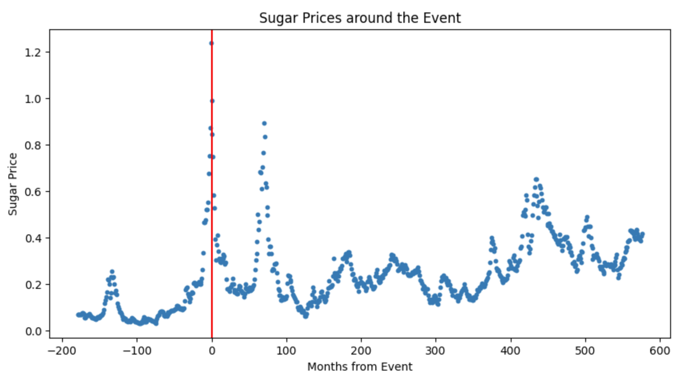
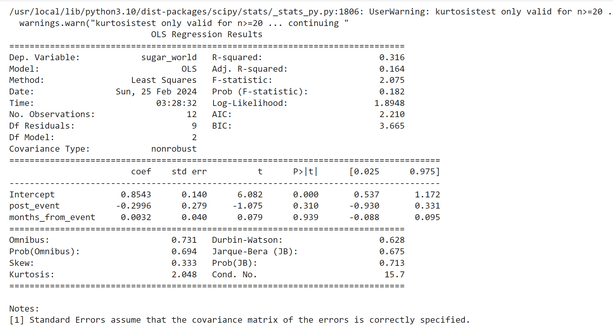
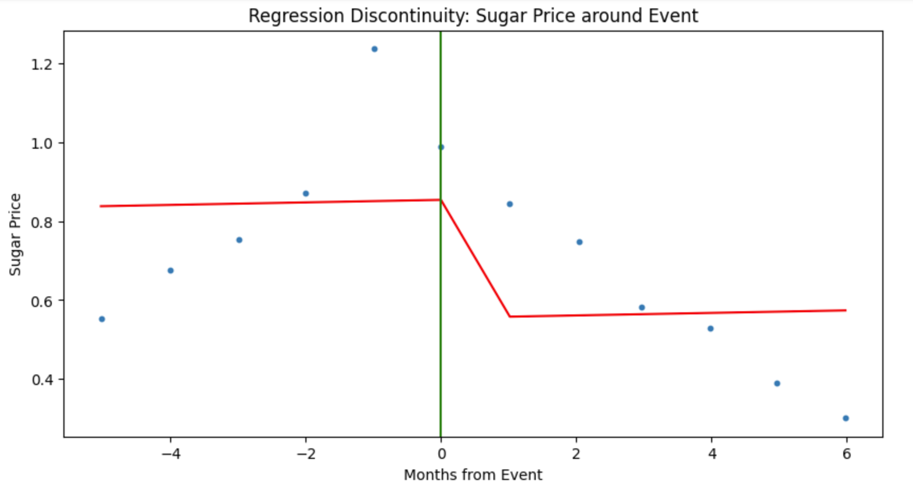

-  In the Readme, describe how your research answers each research question based on the
specific methods.
-  Embed in the Readme a flowchart of question-method-result connections created by open-
source software 
