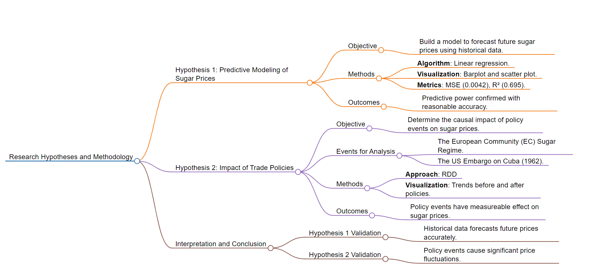

# Description 
This file is used to describe the research result.

*Figure: flowchart created by [markmap.js](https://markmap.js.org/)*
## Result for prediction problem
### Below are the visualization of the result

-  The model reasonably predicts sugar prices with an R² of 0.695, suggesting that roughly 69.5% of the variance in sugar prices is predictable by the model.
-  The low MSE indicates that the model has a small error magnitude in the context of sugar price predictions.

-  Predictive model confirms that historical sugar prices can be used to forecast future prices with reasonable accuracy and low prediction error.

## Result for casual inference

-  The analysis indicates a definite change in sugar price trends corresponding to the moments when each policy was implemented.
-  The findings support the hypothesis that policy events have a measurable effect on sugar prices.

-  The occurrence of the EC Sugar Regime and the US Embargo on Cuba is associated with significant fluctuations in global sugar prices, validating the suspected causal relationship.
